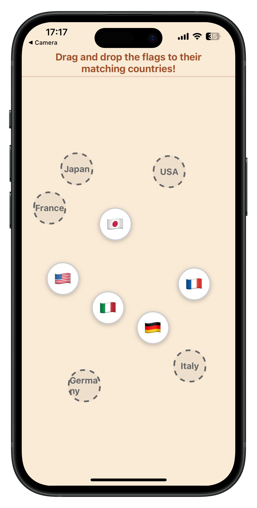

# Flag Dropper Game

> This project showcases a flag dropping game built with React Native and Expo.


## Flag Dropper Game



## Features

- 🎮 **Interactive Drag & Drop Gameplay** - Intuitive touch-based flag matching mechanics
- 🌍 **Country Flag Matching** - Learn flags from USA, France, Germany, Japan, and Italy
- 📱 **Haptic Feedback** - Tactile responses for successful matches and interactions
- 🎉 **Confetti Celebrations** - Visual celebration effects when all flags are matched
- 🎯 **Smart Collision Detection** - Prevents overlapping elements for clean gameplay
- 📏 **Responsive Layout** - Optimized positioning that works across different screen sizes
- 🎨 **Clean UI Design** - Elegant antiquewhite theme with clear visual hierarchy
- ⚡ **Smooth Animations** - Powered by react-native-reanimated for fluid interactions
- 🏆 **Completion Tracking** - Real-time progress monitoring and victory detection
- 📐 **Organized Code Structure** - Modular components and centralized constants for maintainability

## Getting Started

### Prerequisites

- [Node.js](https://nodejs.org/)
- [Expo CLI](https://docs.expo.dev/get-started/installation/)
- [Yarn](https://yarnpkg.com/) or [npm](https://www.npmjs.com/)

### Installation

1. **Clone the repository:**

   ```sh
   git clone https://github.com/thepembeweb/flag-dropper.git
   cd flag-dropper
   ```

2. **Install dependencies:**

   ```sh
   yarn install
   # or
   npm install
   ```

3. **Start the Expo development server:**

   ```sh
   expo start
   ```

4. **Run on your device or simulator:**
   - Scan the QR code with Expo Go (iOS/Android)
   - Or press `i` for iOS simulator, `a` for Android emulator

## Built With

- [React Native](https://reactnative.dev/) - The mobile framework used
- [React Native Reanimated](https://docs.swmansion.com/react-native-reanimated/) - Smooth animations and gesture handling
- [React Native Gesture Handler](https://docs.swmansion.com/react-native-gesture-handler/) - Touch gesture recognition system
- [React Native Confetti Cannon](https://github.com/VincentCATILLON/react-native-confetti-cannon) - Confetti celebration effects
- [Expo](https://expo.dev/) - The platform used to build the universal app
- [Expo Haptics](https://docs.expo.dev/versions/latest/sdk/haptics/) - Haptic feedback for enhanced user experience
- [TypeScript](https://www.typescriptlang.org/) - The programming language used
- [Node.js](https://nodejs.org) - JavaScript runtime

## Authors

- **[Pemberai Sweto](https://github.com/thepembeweb)** - _Initial work_ - [Flag Dropper](https://github.com/thepembeweb/flag-dropper)
